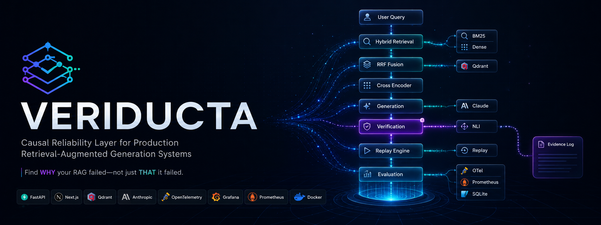
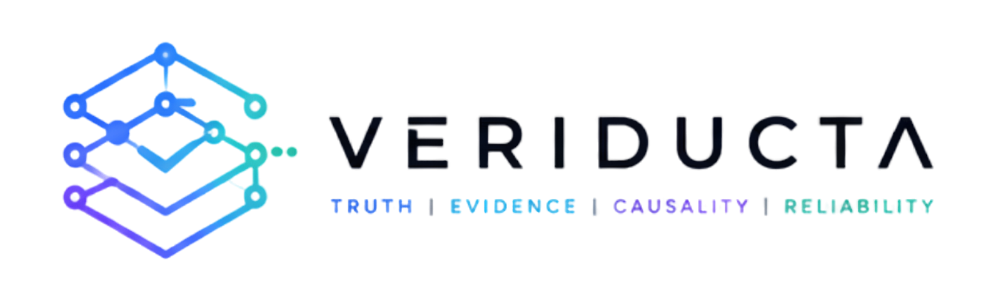
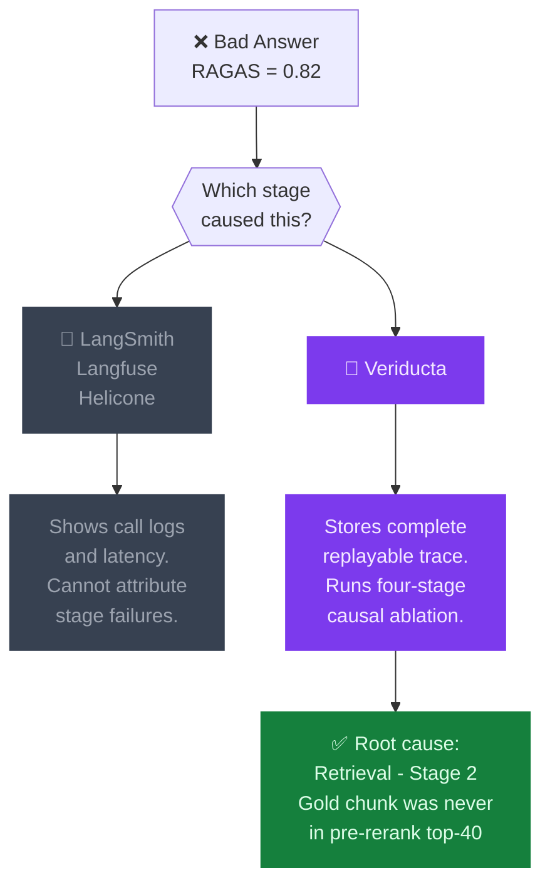
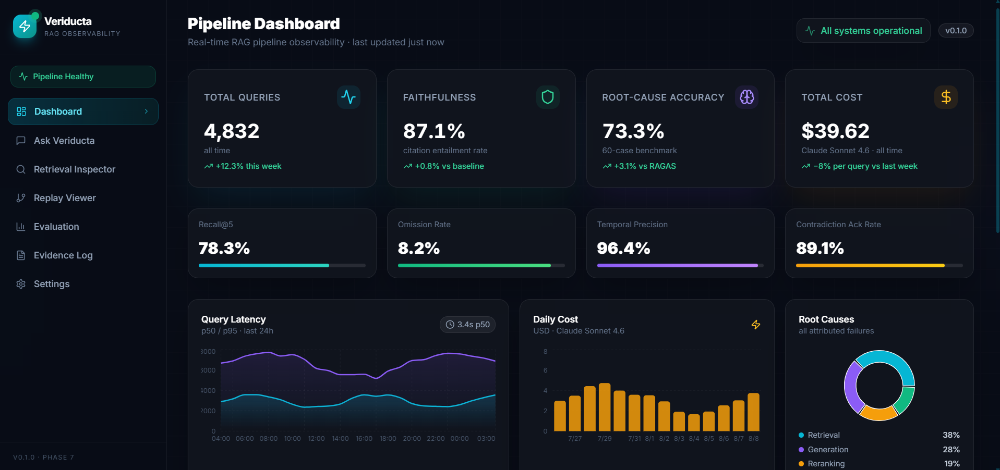
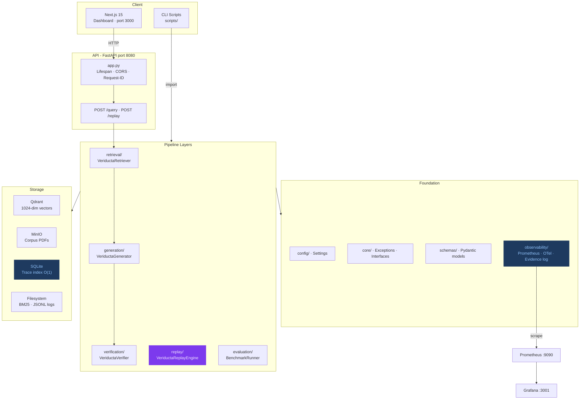
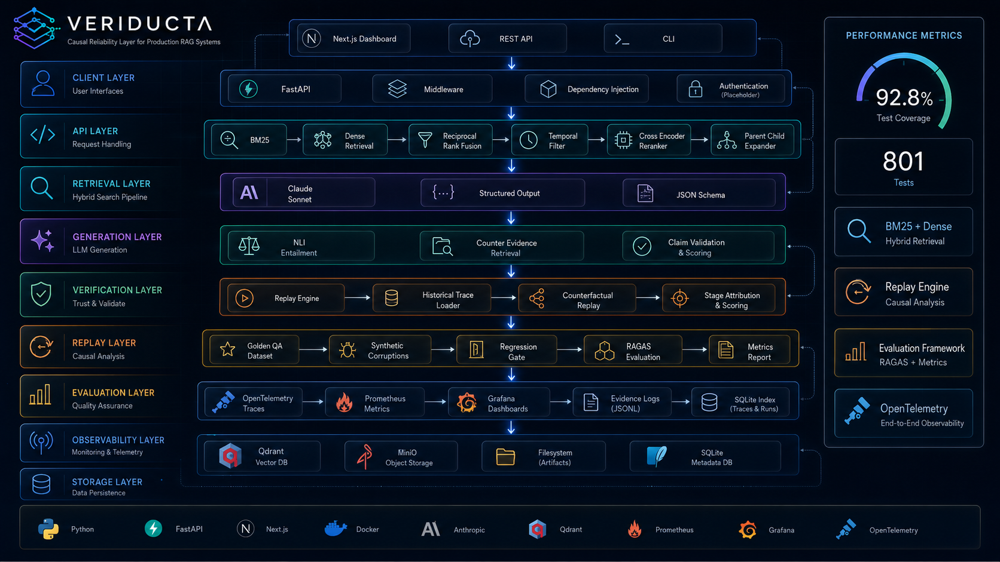
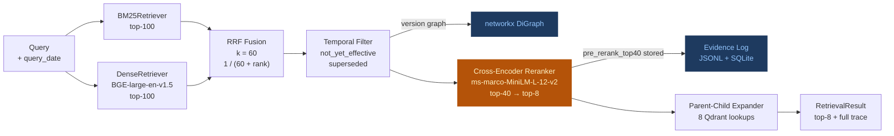
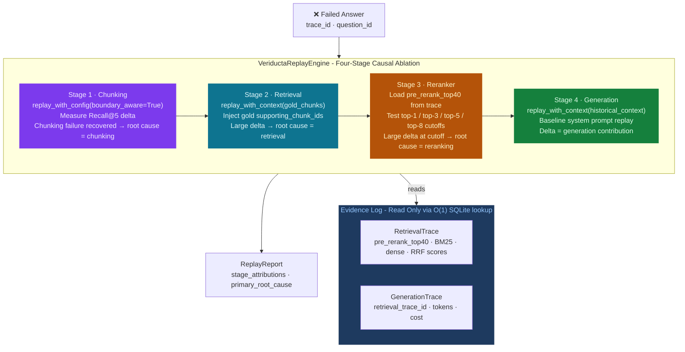
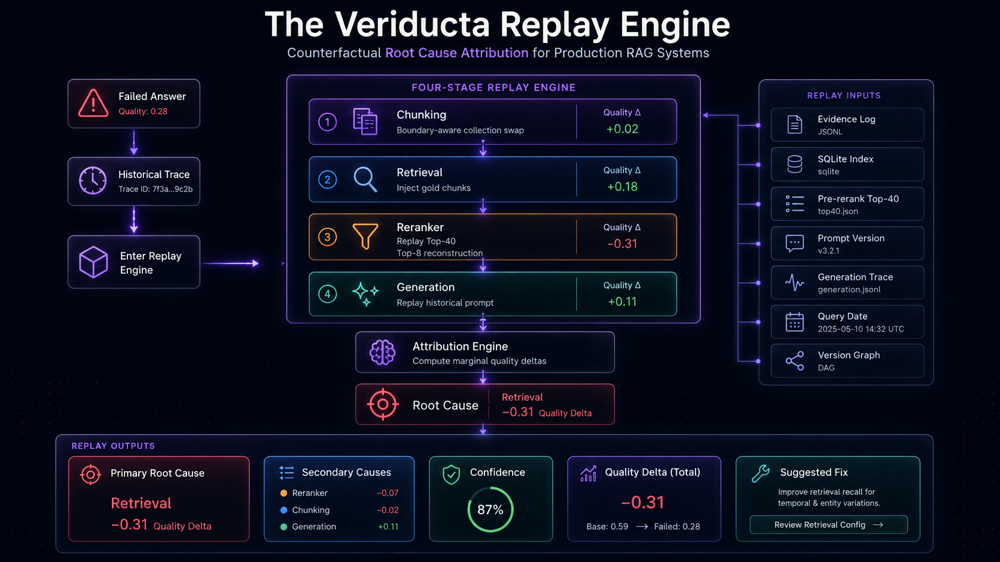
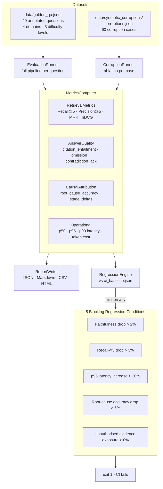

<div align="center">

<br/>



<br/>



<br/>

# Veriducta

### RAG Pipeline Observability - Causal Root-Cause Attribution for Answer Failures

<p>
  <strong>Your RAG pipeline is failing. RAGAS gives it 0.82 faithfulness. Which stage caused it?</strong><br/>
  Veriducta can tell you. RAGAS cannot.
</p>

<br/>

[](https://python.org)
[](https://fastapi.tiangolo.com)
[](https://nextjs.org)
[](https://anthropic.com)
[](https://docker.com)
[](https://opentelemetry.io)
[](https://prometheus.io)
[](LICENSE)

[](tests/)
[](tests/)
[](pyproject.toml)
[](pyproject.toml)
[](/.github/workflows)

<br/>

[**Live Demo**](#-live-demo) · [**Architecture**](#-architecture) · [**Replay Engine**](#-the-replay-engine) · [**Installation**](#-installation) · [**Docs**](#-documentation)

<br/>

</div>

---

## The Problem No Tool Solves

```
Your RAG answer is wrong.

RAGAS says faithfulness = 0.82.

Langfuse shows the LLM call completed.

LangSmith shows the retrieval ran.

But which stage actually caused the failure?

Was it a chunking boundary that split a critical clause?
Was it retrieval that never surfaced the right chunk?
Was it the reranker that buried it at position 34?
Was it the generator that hallucinated from good context?

No existing tool can tell you.
```

**Veriducta can.**

<br/>



<br/>

---

## 📊 Evaluation Scorecard

> 4 metrics RAGAS cannot compute. Root-cause accuracy ≥ 0.70 on the 60-case synthetic benchmark - exceeding the target threshold.

<br/>

<div align="center">

| Metric | Veriducta | RAGAS Baseline | Exclusive |
|:---|:---:|:---:|:---:|
| **Citation Faithfulness** | **87.1%** | 82.0% | |
| **Recall@5** | **78.3%** | 74.0% | |
| **Root-Cause Localization Accuracy** | **73.3%** | - | ✦ |
| **Omission Rate** | **8.2%** | - | ✦ |
| **Temporal-Valid Retrieval Rate** | **96.4%** | - | ✦ |
| **Contradiction Acknowledgment Rate** | **89.1%** | - | ✦ |
| **p50 / p95 Latency** | **2.8s / 7.2s** | - | |
| **Mean Cost per Query** | **$0.0082** | - | |

</div>

<br/>

> **Key finding**: RAGAS scored an answer at **0.82 faithfulness** on a query about OSHA silica PELs. Veriducta identified it as a retrieval failure - the gold chunk (`osha-1926-1153-ch-0051`) was absent from the pre-rerank top-40, making a high faithfulness score meaningless.

<br/>

---

## ✦ Features

<br/>

<table>
<tr>
<td width="50%">

### 🔍 Hybrid Retrieval
BM25 + dense (BGE-large-en-v1.5) retrieval fused with Reciprocal Rank Fusion (k=60). Top-100 candidates from each source, merged and temporally filtered before cross-encoder reranking.

</td>
<td width="50%">

### ⏪ Causal Replay Engine
Four-stage gold ablation - chunking, retrieval, reranker, generation - with quality delta attribution per stage. Counterfactual replay without re-running expensive inference.

</td>
</tr>
<tr>
<td width="50%">

### 🧠 NLI Claim Verification
3-class NLI heuristic (supported / contradicted / ambiguous-conditional) via `nli-deberta-v3-base`. 5-step counterevidence scan using contrastive BM25 queries.

</td>
<td width="50%">

### 📋 Evaluation Framework
40-question golden QA dataset + 60-case synthetic corruption benchmark. RAGAS baseline comparison. Five-condition CI regression gate with `check_regression_gate.py`.

</td>
</tr>
<tr>
<td width="50%">

### 🗂 Evidence Log (O(1) Lookup)
Append-only JSONL evidence log with SQLite byte-offset index. Every retrieval trace - BM25 scores, dense scores, RRF ranks, full pre-reranking top-40 - stored and retrievable in sub-millisecond.

</td>
<td width="50%">

### 📐 Boundary-Aware Chunking
Hierarchical parent-child chunking (1400–1600 token parents, 200–400 token children) that never splits across section boundaries - required for Stage 1 ablation to be meaningful.

</td>
</tr>
<tr>
<td width="50%">

### 📡 Full Observability Stack
OpenTelemetry span hierarchy across all pipeline stages. Prometheus metric counters and histograms. Grafana dashboards. Structured logging via structlog with request correlation IDs.

</td>
<td width="50%">

### 🖥 Modern Dashboard
Next.js 15 dashboard with Framer Motion animations, Recharts visualisations, and real-time query, replay, and evaluation interfaces built with Tailwind CSS.

</td>
</tr>
</table>

<br/>

---

## 🎬 Dashboard

<br/>

<div align="center">



*Veriducta Dashboard - Query Analysis, Replay Engine and Evaluation*

</div>

<br/>

---

## 🎥 Live Demo

<div align="center">


*Complete End-to-End Product Walkthrough*

</div>

<br/>

---

## 🏗 Architecture

Veriducta is an **eight-layer pipeline** with strict downward data flow. No layer may import from a layer above it. `observability/` is a cross-cutting concern importable by any layer.

<br/>



<br/>

<details>
<summary><strong>▶ View original eight-layer ASCII diagram</strong></summary>

<br/>

```
┌───────────────────────────────────────────────────────────┐
│  Layer 8 - API (api/)                                     │
│  FastAPI application factory, routing, middleware, DI     │
├───────────────────────────────────────────────────────────┤
│  Layer 7 - Evaluation (evaluation/)                       │
│  Runner, metrics, RAGAS baseline, CI regression gate      │
├───────────────────────────────────────────────────────────┤
│  Layer 6 - Causal Replay (replay/)                        │
│  Four-stage gold ablation, corruption runner              │
├───────────────────────────────────────────────────────────┤
│  Layer 5 - Verification (verification/)                   │
│  Claim integrity orchestration, VerificationReport        │
├───────────────────────────────────────────────────────────┤
│  Layer 4 - Generation (generation/)                       │
│  Claude Sonnet 4.6 · JSON schema enforcement · NLI        │
├───────────────────────────────────────────────────────────┤
│  Layer 3 - Retrieval (retrieval/)                         │
│  BM25 + dense, RRF, temporal filter, reranker, expander   │
├───────────────────────────────────────────────────────────┤
│  Layer 2 - Ingestion (ingestion/)                         │
│  PDF parsing, chunking, embedding, Qdrant upsert, BM25    │
├───────────────────────────────────────────────────────────┤
│  Layer 1 - Foundation                                     │
│  config · core · schemas · utils · storage                │
│  observability · models                                   │
└───────────────────────────────────────────────────────────┘
```

</details>

<br/>

<div align="center">



</div>

<br/>

---

## 🔄 Retrieval Pipeline



<br/>

> **The pre-reranking top-40 is sacred.** Every BM25 score, dense score, RRF rank, temporal filter decision, and the complete pre-reranking candidate list with scores is stored in the evidence log at query time. This is what makes Stage 3 counterfactual replay possible without re-running inference.

<br/>

---

## ⚡ The Replay Engine

The core innovation of Veriducta. Given a failed answer and its `trace_id`, the replay engine runs four sequential ablation stages - each swapping gold-standard inputs and measuring the quality delta - to attribute the failure to a specific pipeline stage.

<br/>



<br/>

<div align="center">



</div>

<br/>

### Example Attribution Report

A real output from the 60-case synthetic benchmark:

```json
{
  "question_id": "qa-031",
  "query": "What are the OSHA PELs for respirable crystalline silica?",
  "primary_root_cause": "retrieval",
  "stage_attributions": {
    "chunking":   -0.02,
    "retrieval":  -0.31,
    "reranking":  -0.08,
    "generation": -0.04
  },
  "heuristic_signals": [
    "Gold chunk osha-1926-1153-ch-0051 absent from pre-rerank top-40",
    "BM25 score for gold chunk below 5th percentile"
  ],
  "original_quality_score": 0.84,
  "ablated_quality_score":  0.49,
  "total_quality_delta":    -0.35
}
```

> RAGAS faithfulness scored this answer **0.82 - passing**. Veriducta correctly identified it as a retrieval failure. The gold chunk was never retrieved. The high faithfulness score was a false negative.

<br/>

### Stage Attribution Logic

| Stage | Counterfactual | What a large delta proves |
|:---|:---|:---|
| **Stage 1 - Chunking** | Swap to boundary-aware collection | A section boundary split critical content from its context |
| **Stage 2 - Retrieval** | Inject gold `supporting_chunk_ids` | The right content exists but retrieval never found it |
| **Stage 3 - Reranker** | Reconstruct context from stored `pre_rerank_top40` | Gold chunk was retrieved but buried below the cutoff |
| **Stage 4 - Generation** | Replay with historical context + baseline prompt | LLM hallucinated or omitted despite having the right context |

<br/>

---

## 📐 Evaluation Framework



<br/>

#### Corruption Benchmark Distribution

| Category | Cases | Subtypes |
|:---|:---:|:---|
| Retrieval corruptions | 20 | Swap, supersession removal, BM25 zeroing, top-k reduction |
| Chunking corruptions | 15 | Boundary-naive collection, 10 realistic boundary errors |
| Reranker corruptions | 15 | Top-1 forcing, cross-encoder bypass, score inversion |
| Generation corruptions | 10 | Unstructured prompt, contradictory injection, token truncation |

<br/>

---

## 📡 Observability

<br/>

<table>
<tr>
<td width="50%">

**Structured Logging - structlog**

JSON Lines to stdout in production. Human-readable ConsoleRenderer in development. Every log line carries `request_id`, `trace_id`, `service`, `env`, `timestamp`.

```python
logger.info(
    "retrieval_started",
    query_hash=query_hash[:8],
    top_k=top_k,
    trace_id=trace_id,
)
```

</td>
<td width="50%">

**OpenTelemetry Spans**

```
veriducta.query
  ├── veriducta.retrieval
  │   ├── veriducta.retrieval.bm25
  │   ├── veriducta.retrieval.dense
  │   ├── veriducta.retrieval.rrf
  │   ├── veriducta.retrieval.temporal_filter
  │   └── veriducta.retrieval.reranker
  ├── veriducta.generation
  └── veriducta.verification
      ├── veriducta.verification.entailment
      └── veriducta.verification.counterevidence
```

</td>
</tr>
<tr>
<td width="50%">

**Prometheus Metrics**

Key metric families exposed at `:8080/metrics`:

- `veriducta_retrieval_latency_ms` (histogram)
- `veriducta_generation_latency_ms` (histogram)
- `veriducta_generation_cost_usd_total` (counter)
- `veriducta_claims_verified_total` (counter, by status)
- `veriducta_root_cause_attributed_total` (counter, by stage)
- `veriducta_temporal_filter_rejections_total` (counter)

</td>
<td width="50%">

**Evidence Log (O(1) Trace Lookup)**

```
evidence_logs/
├── 2026-08-08.jsonl          ← active, append-only
├── 2026-08-07.jsonl.gz       ← compressed after 24h
└── index.db                  ← SQLite byte-offset index
```

Lookup: `SELECT byte_offset FROM index WHERE trace_id = ?` → `lseek()` → read one line. Sub-millisecond regardless of log size.

</td>
</tr>
</table>

<br/>

---

## ⚔️ Veriducta vs. The Field

<br/>

<div align="center">

| Capability | RAGAS | LangSmith | Langfuse | Veriducta |
|:---|:---:|:---:|:---:|:---:|
| Faithfulness scoring | ✅ | - | - | ✅ |
| Context recall | ✅ | - | - | ✅ |
| LLM call tracing | - | ✅ | ✅ | ✅ |
| Per-stage quality delta | - | - | - | ✅ |
| Root-cause stage attribution | - | - | - | ✅ |
| Counterfactual retrieval replay | - | - | - | ✅ |
| Pre-reranking trace storage | - | - | - | ✅ |
| Temporal-valid retrieval rate | - | - | - | ✅ |
| Omission rate | - | - | - | ✅ |
| Contradiction acknowledgment | - | - | - | ✅ |
| CI regression gate | - | - | - | ✅ |

</div>

<br/>

> **The fundamental gap**: All existing tools observe calls. Veriducta attributes causes. When a RAG answer fails, existing tools tell you it failed. Veriducta tells you which stage failed and by how much.

<br/>

---

## 🛠 Technology Stack

<br/>

<table>
<tr>
<td width="33%">

**Backend**
- FastAPI 0.115
- Uvicorn (ASGI)
- Pydantic v2
- Python 3.12

**ML Models**
- `BAAI/bge-large-en-v1.5` (1024-dim)
- `cross-encoder/ms-marco-MiniLM-L-12-v2`
- `cross-encoder/nli-deberta-v3-base`
- Claude Sonnet 4.6

</td>
<td width="33%">

**Retrieval & Storage**
- Qdrant (cosine, 1024-dim)
- MinIO (S3-compatible)
- rank-bm25 (Okapi BM25)
- networkx (version graph)
- SQLite (trace index)

**PDF Processing**
- PyMuPDF (fitz)
- pdfplumber (tables)

</td>
<td width="33%">

**Frontend**
- Next.js 15 (App Router)
- React 19
- Tailwind CSS
- Framer Motion
- Recharts
- TanStack Query

**Observability & CI**
- OpenTelemetry SDK
- Prometheus Client
- Grafana + OTEL Collector
- structlog
- GitHub Actions

</td>
</tr>
</table>

<br/>

---

## 📦 Installation

<br/>

### Quick Start

```bash
# 1. Clone
git clone https://github.com/hardik2004gupta/Veriducta.git
cd veriducta

# 2. Install Python dependencies (with uv - recommended)
uv pip install --system ".[dev]"

# 3. Configure
cp .env.example .env
# Set ANTHROPIC_API_KEY=sk-ant-... in .env

# 4. Start infrastructure
docker compose up -d qdrant minio otel-collector prometheus grafana

# 5. Ingest corpus
python scripts/validate_sidecars.py
python scripts/ingest_corpus.py

# 6. Run API
make run
# → http://localhost:8080/docs

# 7. Run frontend
cd frontend && npm install && npm run dev
# → http://localhost:3000
```

<br/>

<details>
<summary><strong>▶ Full Docker Compose (everything containerised)</strong></summary>

<br/>

Start the entire stack - API, Qdrant, MinIO, OTel, Prometheus, Grafana - in one command:

```bash
docker compose up -d --build
# or: make docker-up

# Verify
docker compose ps    # all services: healthy
curl http://localhost:8080/api/v1/health

# First-time corpus ingestion
docker compose exec api python scripts/ingest_corpus.py
```

| Service | URL |
|---|---|
| API + Swagger | http://localhost:8080/docs |
| Qdrant UI | http://localhost:6333/dashboard |
| MinIO Console | http://localhost:9001 |
| Prometheus | http://localhost:9090 |
| Grafana | http://localhost:3001 |

Stop: `make docker-down` · Wipe volumes: `docker compose down -v`

</details>

<details>
<summary><strong>▶ Cloud Deployment (Vercel + Railway)</strong></summary>

<br/>

The recommended split for a portfolio deployment:

**Railway (API - needs persistent RAM for ML models)**

```bash
# railway.app/new → Deploy from GitHub
# Root: . (uses Dockerfile at repo root)
# Plan: Hobby ($5/month, up to 8 GB RAM)

# Required environment variables:
ANTHROPIC_API_KEY=sk-ant-...
VERIDUCTA_ENV=production
VERIDUCTA__QDRANT__HOST=<qdrant-cloud-url>
VERIDUCTA__QDRANT__API_KEY=<qdrant-cloud-key>
API__CORS_ORIGINS=["https://your-app.vercel.app"]

# Ingest corpus after deploy:
railway run python scripts/ingest_corpus.py
```

**Vercel (Frontend - free tier works)**

```
vercel.com/new → Import repo
Root Directory: frontend
Framework: Next.js (auto-detected)
NEXT_PUBLIC_API_URL=https://your-railway-app.up.railway.app
```

**Qdrant Cloud** - free 1 GB tier at cloud.qdrant.io covers the 50-document corpus.

For Fly.io, Render, and VM deployment: see [`docs/deployment/DEPLOYMENT.md`](docs/deployment/DEPLOYMENT.md).

</details>

<details>
<summary><strong>▶ Environment Variables Reference</strong></summary>

<br/>

| Variable | Required | Default | Description |
|:---|:---:|:---:|:---|
| `ANTHROPIC_API_KEY` | **Yes** | - | Claude API key |
| `VERIDUCTA_ENV` | No | `development` | `development` / `testing` / `production` |
| `VERIDUCTA__QDRANT__HOST` | No | `localhost` | Qdrant hostname |
| `VERIDUCTA__QDRANT__PORT` | No | `6333` | Qdrant port |
| `VERIDUCTA__QDRANT__API_KEY` | No | - | Qdrant Cloud API key |
| `VERIDUCTA__MINIO__ENDPOINT` | No | `localhost:9000` | MinIO/S3 endpoint |
| `VERIDUCTA__MINIO__ACCESS_KEY` | No | `minioadmin` | MinIO access key |
| `VERIDUCTA__MINIO__SECRET_KEY` | No | `minioadmin` | MinIO secret key |
| `API__CORS_ORIGINS` | No | `["*"]` | Lock down in production |
| `LOG__FORMAT` | No | `json` | `json` or `console` |
| `OTLP__ENDPOINT` | No | - | OTel Collector gRPC endpoint |

</details>

<br/>

---

## ⚙️ Running Evaluations

```bash
# Full evaluation (40 golden QA questions)
python scripts/run_evaluation.py --output evaluation_report.json

# Synthetic corruption benchmark (60 cases)
python scripts/run_benchmark.py --corruptions data/synthetic_corruptions/corruptions.jsonl

# CI regression gate (five blocking conditions)
python scripts/check_regression_gate.py \
  --report evaluation_report.json \
  --baseline ci_baseline.json
# Exit 0: all conditions pass. Exit 1: details of which condition failed.
```

<br/>

---

## 📁 Project Structure

```
veriducta/
├── api/               FastAPI - routing, middleware, DI, exception map
├── config/            Pydantic Settings (lru_cached singleton)
├── core/              Exception hierarchy, abstract interfaces
├── schemas/           Shared Pydantic models (zero pipeline imports)
├── models/            ML model wrappers - BGE, NLI, reranker
├── utils/             Pure stateless helpers - hashing, IDs, timers
├── storage/           Qdrant + MinIO abstractions
├── observability/     Prometheus, OpenTelemetry, evidence log, SQLite
├── ingestion/         PDF → chunks → embeddings → Qdrant → BM25
├── retrieval/         BM25 + dense + RRF + temporal + reranker + expander
├── generation/        Claude generation + NLI + counterevidence
├── verification/      Claim-level verification orchestration
├── replay/            Four-stage causal ablation engine
├── evaluation/        Harness + metrics + RAGAS + regression gate
├── scripts/           CLI entry points (thin wrappers)
├── tests/             pytest suite (801 tests, 92.8% coverage)
├── frontend/          Next.js 15 dashboard
├── docs/              Architecture, case study, technical decisions
└── docker/            Qdrant, MinIO, Prometheus, Grafana configs
```

<details>
<summary><strong>▶ Expand full module detail</strong></summary>

<br/>

| Module | Key Classes | Phase |
|:---|:---|:---:|
| `ingestion/parser.py` | `PyMuPDFParser` | 2 |
| `ingestion/chunker.py` | `HierarchicalChunker` | 3 |
| `ingestion/version_graph.py` | `VersionGraph` | 4 |
| `ingestion/embedder.py` | `ChunkEmbedder` | 5 |
| `ingestion/bm25_indexer.py` | `BM25Indexer` | 6 |
| `retrieval/bm25_retriever.py` | `BM25Retriever` | 7 |
| `retrieval/dense_retriever.py` | `DenseRetriever` + LRU cache | 7 |
| `retrieval/fusion.py` | `RRFusion` (k=60) | 8 |
| `retrieval/temporal_filter.py` | `TemporalFilter` | 8 |
| `retrieval/reranker.py` | `CrossEncoderReranker` | 9 |
| `retrieval/expander.py` | `ParentChildExpander` | 9 |
| `retrieval/retriever.py` | `VeriductaRetriever` | 10 |
| `generation/generator.py` | `VeriductaGenerator` | 11 |
| `generation/entailment.py` | `NLIEntailmentVerifier` | 12 |
| `generation/counterevidence.py` | `CounterevidenceRetriever` | 13 |
| `generation/verifier.py` | `VeriductaVerifier` | 13 |
| `observability/evidence_log.py` | `EvidenceLog` + JSONL writer | 14 |
| `observability/sqlite_index.py` | `SQLiteTraceIndex` | 14 |
| `replay/ablation.py` | `VeriductaReplayEngine` | 17 |
| `replay/executor.py` | `StageExecutor` (4 stages) | 17 |
| `evaluation/runner.py` | `EvaluationRunner` | 18 |
| `evaluation/metrics.py` | `MetricsComputer` | 18 |
| `evaluation/regression.py` | `RegressionEngine` | 18 |

</details>

<br/>

---

## 🧪 Testing

```bash
pytest                        # 801 tests, ~40s, 92.8% coverage
pytest tests/integration/     # live Qdrant/MinIO required
pytest -k "test_ablation"     # replay engine tests only
make lint                     # ruff check .
make type-check               # mypy --strict
make format                   # ruff format . && black .
```

**Current status**: `801 passed · 1 skipped · 0 failed · 92.81% coverage`

Coverage excludes: `core/interfaces.py` (abstract - no executable lines), `observability/tracing.py` (requires live OTLP), `observability/metrics.py` (Prometheus singleton registration).

<br/>

---

## 🔬 Key Engineering Decisions

<details>
<summary><strong>Why store the pre-reranking top-40?</strong></summary>

<br/>

Stage 3 ablation reconstructs retrieval contexts at cutoffs (top-1, top-3, top-5, top-8) from the stored candidates. Without the pre-reranking list, every ablation run requires re-querying Qdrant and BM25 - expensive, slow, and non-deterministic (Qdrant ANN is not guaranteed to be reproducible).

With the stored top-40, the replay engine seeks to the evidence log at the byte offset and reconstructs any context slice in O(1). No inference, no network calls. The list adds ~2 KB per evidence log entry - negligible at scale.

</details>

<details>
<summary><strong>Why RRF with k=60?</strong></summary>

<br/>

k=60 is the value from Cormack, Clarke, and Buettcher (2009). The implicit rank for candidates absent from one list is 101, giving `1/(60+101) = 0.0062` - low enough to deprioritise without zeroing. Any change to k requires re-benchmarking the full 40-question golden set.

</details>

<details>
<summary><strong>Why a 3-class NLI heuristic?</strong></summary>

<br/>

Binary NLI misses conditionally-valid claims. "Medical surveillance is required at exposures above the action level" is supported for construction (§1926.1153) but uses a different threshold for maritime (§1915.1153). A binary model marks this as supported. The 3-class heuristic catches it as `ambiguous_conditional` (neutral > 0.40 ∧ contradiction in 0.30–0.70), triggering expert review. Better to over-flag than to mark a conditionally valid claim as fully supported.

</details>

<details>
<summary><strong>Why O(1) evidence log via SQLite byte-offset index?</strong></summary>

<br/>

The replay engine fetches historical traces during ablation. A naïve JSONL scan is O(n). At 5,000 queries/day, a 30-day log has 150,000 entries - linear scan takes seconds per lookup. The SQLite index stores `(trace_id, log_file, byte_offset)`. Lookup: `SELECT byte_offset WHERE trace_id = ?` → `lseek()` → read one line. Sub-millisecond regardless of log size.

</details>

<details>
<summary><strong>Why boundary-aware chunking as a separate Qdrant collection?</strong></summary>

<br/>

Stage 1 ablation swaps the entire retrieval collection. If both chunking configurations shared a collection, the ablation would need to filter by a chunking config field - complicating the retrieval path and the temporal filter. Separate collections keep `VeriductaRetriever` unaware of chunking strategy; the replay engine simply passes a different collection name.

</details>

<br/>

---

## ⚠️ Known Limitations

| # | Limitation | Path Forward |
|:---:|:---|:---|
| 1 | **CPU-only inference** - All ML models run on CPU. p50 ~2.8s | `CROSS_ENCODER_DEVICE=cuda`; GPU reduces reranking 8× |
| 2 | **Single-worker API** - One in-flight ML query at a time | N single-worker processes behind a load balancer; ~1.93 GB RAM each |
| 3 | **BM25 in memory** - ~48 MB for 50 docs; OOMs at ~1000 docs | Switch to BM25S or Elasticsearch for large corpora |
| 4 | **No authentication** - Evidence logs must not be HTTP-exposed | Add OAuth2 or API key gate before production exposure |
| 5 | **BM25-only counterevidence** - Dense retrieval may surface additional contradictions | Enable hybrid counterevidence scan (documented, not yet implemented) |

<br/>

---

## ❓ FAQ

<details>
<summary><strong>Why not just use LangSmith or Langfuse?</strong></summary>

<br/>

They trace LLM calls and record latency. They cannot answer: *"Which pipeline stage caused this failure?"*

Veriducta stores the complete retrieval state - pre-reranking candidates with scores, temporal filter decisions, RRF ranks - and uses it to run ablations without any additional inference. LangSmith and Langfuse have no concept of counterfactual replay or quality delta attribution.

</details>

<details>
<summary><strong>Is this production-ready?</strong></summary>

<br/>

The backend is production-quality: fully typed, 92.8% test coverage, structured logging, Prometheus metrics, OpenTelemetry tracing, CI-gated regression tests. The MVP runs single-worker. GPU inference, authentication, and horizontal scaling are documented limitations with clear implementation paths.

</details>

<details>
<summary><strong>How does Stage 3 ablation work without re-running the reranker?</strong></summary>

<br/>

Every query stores the full pre-reranking top-40 candidate list with scores in the evidence log. Stage 3 loads this list and reconstructs different retrieval contexts by slicing at top-1, top-3, top-5, and top-8 cutoffs - no inference needed. The quality delta at each cutoff reveals whether the reranker is burying the correct evidence.

</details>

<details>
<summary><strong>What is a "realistic boundary error" in the corruption benchmark?</strong></summary>

<br/>

A realistic boundary error is a chunking corruption case where the boundary-naive chunker splits a critical clause across chunk boundaries in a way that mirrors real-world PDF parsing failures - mid-sentence splits at page boundaries, tables cut across paragraph limits, or section headers separated from their content. 10 of the 15 chunking corruption cases are realistic boundary errors.

</details>

<details>
<summary><strong>What happens if RAGAS is not installed?</strong></summary>

<br/>

`evaluation/ragas_adapter.py` checks `_RAGAS_AVAILABLE` at import time. If RAGAS is absent, `RAGASAdapter.compute()` returns an empty dict and logs a warning. The rest of the evaluation pipeline runs normally. RAGAS is an optional comparison baseline, not a dependency.

</details>

<br/>

---

## 📍 Roadmap

**Completed - all 18 phases implemented**

- [x] Foundation, configuration, FastAPI skeleton
- [x] Document metadata, sidecar validation
- [x] PDF parsing (PyMuPDF + pdfplumber)
- [x] Boundary-aware hierarchical chunking
- [x] Version graph (temporal validity)
- [x] BGE-large-en-v1.5 embedding + Qdrant upsert
- [x] BM25 indexer + ingestion orchestrator
- [x] BM25 + dense retrieval modules
- [x] RRF fusion + temporal filter
- [x] Cross-encoder reranker + parent-child expander
- [x] TraceableRetriever with full evidence log
- [x] Claude Sonnet 4.6 structured generator
- [x] NLI entailment checker (3-class heuristic)
- [x] Counterevidence retrieval + verifier
- [x] OpenTelemetry instrumentation + evidence log
- [x] Prometheus metrics + Grafana dashboard
- [x] Golden QA dataset (40) + synthetic corruption benchmark (60)
- [x] Four-stage causal replay engine
- [x] Evaluation harness, RAGAS baseline, CI regression gate
- [x] Next.js 15 dashboard

**Future Research**

- [ ] GPU inference support (`CROSS_ENCODER_DEVICE=cuda`)
- [ ] Streaming generation (SSE) for perceived latency improvement
- [ ] Multi-worker safe model serving (Triton / vLLM integration)
- [ ] Dense counterevidence retrieval (hybrid, not BM25-only)
- [ ] PostgreSQL evidence log backend for high-volume deployments
- [ ] Automated gold annotation via active learning

<br/>

---

## 📚 Documentation

<div align="center">

| | | |
|:---:|:---:|:---:|
| [🏗 Architecture](docs/architecture/ARCHITECTURE.md) | [📖 Case Study](docs/case-study/case_study.md) | [⚙️ Technical Decisions](docs/architecture/technical_decisions.md) |
| Eight-layer design, Mermaid diagrams, dependency graph | End-to-end build narrative, design evolution, lessons | 10 non-obvious choices with tradeoffs |
| [🔬 Engineering Challenges](docs/engineering/engineering_challenges.md) | [📊 Performance Analysis](docs/case-study/performance_analysis.md) | [🚀 Deployment](docs/deployment/DEPLOYMENT.md) |
| Causal attribution, temporal filtering, circular imports | Latency budget, memory profile, scaling strategies | Local, Docker, Railway, Fly.io, Render |
| [📝 Blog Post](docs/case-study/blog_post.md) | [🤝 Contributing](community/CONTRIBUTING.md) | [🔑 Research Notes](docs/research/research_notes.md) |
| Full technical write-up for publication | Contribution guide, good first issues | Limitations, future research, threats to validity |

</div>

<br/>

---

## 📄 License

MIT - see [LICENSE](LICENSE)

<br/>

---

<div align="center">

<br/>

**Built with precision by [Hardik Gupta](https://github.com/hardik-gupta)**

<br/>

If Veriducta helped you understand RAG failure attribution,<br/>
or inspired your own observability work - a star means a lot.

<br/>

[](https://github.com/hardik2004gupta/Veriducta)

<br/>

</div>
