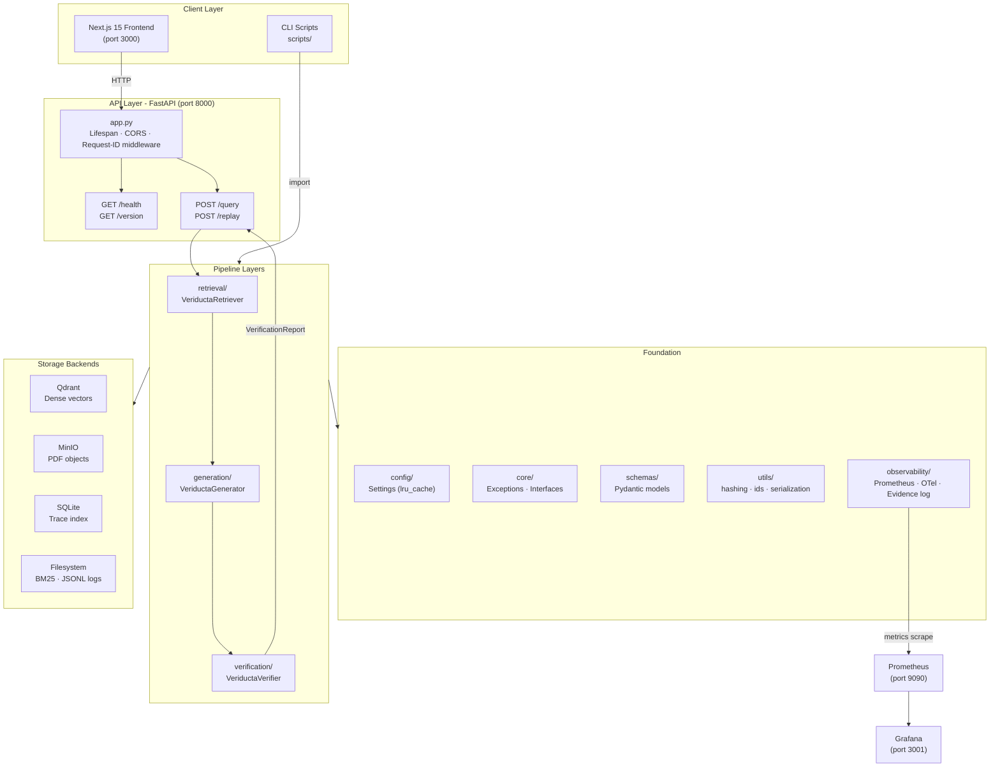
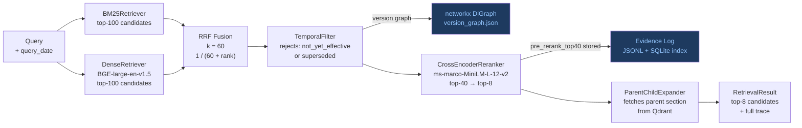
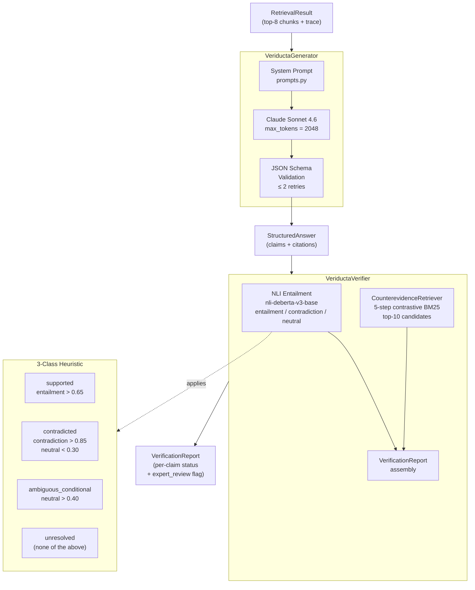
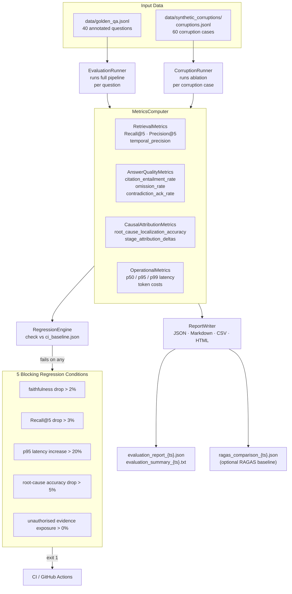
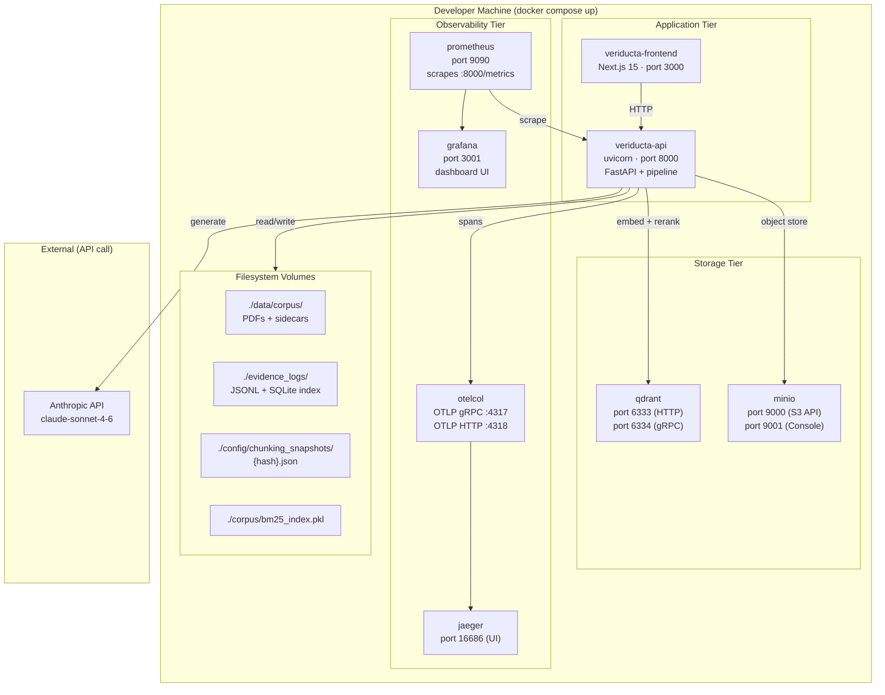

# Architecture

## Eight-Layer Architecture

```
┌───────────────────────────────────────────────────────────┐
│  Layer 8 - API (api/)                                     │
│  FastAPI application factory, routing, middleware, DI     │
├───────────────────────────────────────────────────────────┤
│  Layer 7 - Evaluation (evaluation/)                       │
│  Runner, metrics, RAGAS baseline, CI regression gate      │
├───────────────────────────────────────────────────────────┤
│  Layer 6 - Causal Replay (replay/)                        │
│  Four-stage gold ablation, corruption runner              │
├───────────────────────────────────────────────────────────┤
│  Layer 5 - Verification (verification/)                   │
│  Claim integrity orchestration, VerificationReport        │
├───────────────────────────────────────────────────────────┤
│  Layer 4 - Generation (generation/)                       │
│  Claude structured output, NLI, counterevidence           │
├───────────────────────────────────────────────────────────┤
│  Layer 3 - Retrieval (retrieval/)                         │
│  BM25 + dense, RRF, temporal filter, reranker, expander   │
├───────────────────────────────────────────────────────────┤
│  Layer 2 - Ingestion (ingestion/)                         │
│  PDF parsing, chunking, embedding, Qdrant upsert, BM25    │
├───────────────────────────────────────────────────────────┤
│  Layer 1 - Foundation                                     │
│  config · core · schemas · utils · storage                │
│  observability · models                                   │
└───────────────────────────────────────────────────────────┘
```

Data flows strictly downward. No layer may import from a layer above it.
`observability` is a cross-cutting concern importable by any layer.

---

## Diagram 1 - Overall System Architecture



---

## Diagram 2 - Retrieval Pipeline



---

## Diagram 3 - Generation & Verification Pipeline



---

## Diagram 4 - Causal Replay Engine (Four-Stage Ablation)

```mermaid
flowchart TD
    FAIL["Failed / Low-Quality Answer\n(trace_id + question_id)"] --> AE

    subgraph AE["VeriductaReplayEngine"]

        S1["Stage 1 - Chunking\nreplay_with_config(boundary_aware=True)\ncompute Recall@5 delta\n↓ if delta > threshold → root cause = chunking"]

        S2["Stage 2 - Retrieval\nreplay_with_context(gold_chunks)\ncompute quality delta\n↓ if delta > threshold → root cause = retrieval"]

        S3["Stage 3 - Reranker\nload pre_rerank_top40 from trace\ntest top-1/3/5/8 cutoffs\ncompute quality deltas\n↓ if delta > threshold → root cause = reranking"]

        S4["Stage 4 - Generation\nreplay_with_context(historical context)\nbaseline prompt\ncompute quality delta\n↓ if delta > threshold → root cause = generation"]

        S1 --> S2 --> S3 --> S4
    end

    AE --> RR["ReplayReport\nstage_attributions: dict[str, float]\nprimary_root_cause: RootCauseStage"]

    subgraph EL["Evidence Log (read-only)"]
        TL["RetrievalTrace\npre_rerank_top40\nBM25/dense/RRF scores"]
        GL["GenerationTrace\nretrieval_trace_id link\ninput/output tokens"]
    end

    AE -->|reads via O(1) SQLite lookup| EL

    style S1 fill:#7c3aed,color:#f3e8ff
    style S2 fill:#0e7490,color:#e0f7fa
    style S3 fill:#b45309,color:#fef3c7
    style S4 fill:#15803d,color:#dcfce7
```

---

## Diagram 5 - Evaluation Pipeline



---

## Diagram 6 - Deployment Architecture



---

## Evaluation Framework

The `evaluation/` package implements the complete Phase 18 evaluation harness.

| Component | Class | Purpose |
|---|---|---|
| `runner.py` | `EvaluationRunner` | Executes queries through the full pipeline; captures per-query latency and errors |
| `metrics.py` | `MetricsComputer` | Computes all four metric groups from `EvaluationRunResults` |
| `regression.py` | `RegressionEngine` | Checks five blocking conditions against a stored baseline |
| `comparison.py` | `RunComparator` | Produces per-metric deltas across two evaluation runs |
| `baseline.py` | `BaselineRunner` | Runs alternative pipeline configurations (dense-only, BM25-only, etc.) |
| `report.py` | `ReportWriter` | Serialises results to JSON, Markdown, CSV, and HTML |
| `benchmark.py` | `BenchmarkRunner` | Top-level orchestrator that wires all components together |
| `ragas_adapter.py` | `RAGASAdapter` | Optional RAGAS integration; gracefully skipped when unavailable |

**Dependency injection**: All `EvaluationRunner` constructor arguments are optional (`None`).
Tests run without any live ML models or services.

---

## Storage Layer

| Backend    | Purpose                                       |
|------------|-----------------------------------------------|
| Qdrant     | Dense vector store for chunk embeddings       |
| MinIO      | Object storage for corpus PDFs and artifacts  |
| SQLite     | Evidence log index (O(1) trace lookup)        |
| Filesystem | BM25 index pickle, config snapshots, logs     |

---

## Observability Stack

| Component      | Role                                      |
|----------------|-------------------------------------------|
| structlog      | JSON structured application logs          |
| OpenTelemetry  | Distributed tracing across pipeline spans |
| Prometheus     | Metrics scrape endpoint (`:8000/metrics`) |
| Grafana        | Dashboard over Prometheus data            |
| OTLP Collector | Span aggregation and metric forwarding    |
| Jaeger         | Distributed trace UI                      |

---

## Interface Boundaries

All pipeline components implement abstract interfaces defined in `core/interfaces.py`.
This allows the causal replay engine to swap configurations without re-running expensive
components - for example, substituting a stored pre-reranking trace (40 candidates with
scores) instead of re-running cross-encoder inference for Stage 3 ablation.

---

## Dependency Graph

```
schemas ─────────────────────────────────────────────┐
utils   ─────────────────────────────────────────────┤
config  ───────────────────────────────────────────┐ │
                                                   │ │
core    ──(imports config)─────────────────────────┤ │
storage ──(imports core) ──────────────────────────┤ │
                                                   ▼ ▼
models  ──────────────────────────────────────► ingestion
                                                      │
observability ────────────────────────────────────────┤
                                                      ▼
                                                 retrieval
                                                      │
                                                      ▼
                                                 generation
                                                      │
                                                      ▼
                                              verification
                                                      │
                                                      ▼
                                                   replay
                                                      │
                                                      ▼
                                                 evaluation
                                                      │
                                                      ▼
                                                     api
```

---

## OTel Span Hierarchy

```
veriducta.query
  ├── veriducta.retrieval
  │   ├── veriducta.retrieval.bm25
  │   ├── veriducta.retrieval.dense
  │   ├── veriducta.retrieval.rrf
  │   ├── veriducta.retrieval.temporal_filter
  │   └── veriducta.retrieval.reranker
  ├── veriducta.generation
  └── veriducta.verification
      ├── veriducta.verification.entailment
      └── veriducta.verification.counterevidence
```

Every span carries: `config_snapshot_hash`, `input_hash`, `output_hash`, `latency_ms`.
